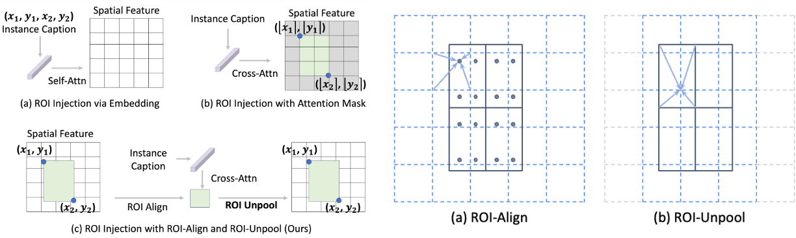
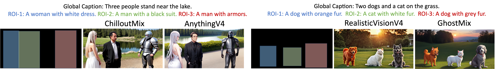
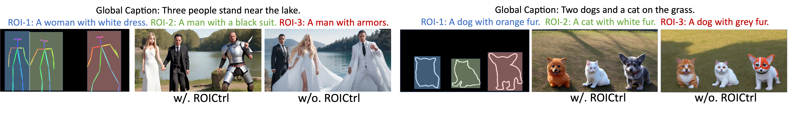
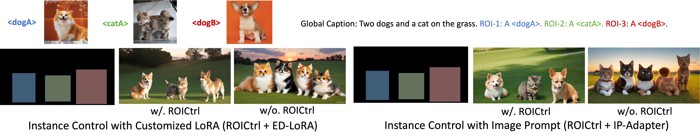

# ROICtrl

**[Arxiv 2024] - [ROICtrl: Boosting Instance Control for Visual Generation](https://arxiv.org/abs/2411.17949)**
<br/>

[Yuchao Gu](https://ycgu.site/),
[Yipin Zhou](https://yipin.github.io/),
Yunfan Ye,
[Yixin Nie](https://easonnie.github.io/),
[Licheng Yu](https://lichengunc.github.io/)<br/>
[Pingchuan Ma](https://pingchuan.ma/),
[Kevin Qinghong Lin](https://qinghonglin.github.io/),
[Mike Zheng Shou](https://sites.google.com/view/showlab)
<br/>

Showlab, National University of Singapore; GenAI, Meta; MIT

[](https://arxiv.org/abs/2411.17949)
[](https://roictrl.github.io/)
<a href="https://drive.google.com/drive/folders/1bXqskly5kER_bJ47n9CwH9NQEkMHs3zi?usp=drive_link"></a>


## Update

- [ ] Training code will released in two weeks.
- [x] [2024/12/10] Inference Demo and Model Released.


**ROICtrl** can extend existing diffusion models and their add-ons (e.g., ControlNet, T2I-Adapter, IP-Adapter, ED-LoRA) to support controllable multi-instance generation. 
>Natural language often struggles to accurately associate positional and attribute information with multiple instances, which limits current text-based visual generation models to simpler compositions featuring only a few dominant instances. To address this limitation, this work enhances diffusion models by introducing regional instance control, where each instance is governed by a bounding box paired with a free-form caption. Previous methods in this area typically rely on implicit position encoding or explicit attention masks to separate regions of interest (ROIs), resulting in either inaccurate coordinate injection or large computational overhead. Inspired by ROI-Align in object detection, we introduce a complementary operation called ROI-Unpool. Together, ROI-Align and ROI-Unpool enable explicit, efficient, and accurate ROI manipulation on high-resolution feature maps for visual generation. Building on ROI-Unpool, we propose ROICtrl, an adapter for pretrained diffusion models that enables precise regional instance control. ROICtrl is compatible with community-finetuned diffusion models, as well as with existing spatial-based add-ons (\eg, ControlNet, T2I-Adapter) and embedding-based add-ons (\eg, IP-Adapter, ED-LoRA), extending their applications to multi-instance generation. Experiments show that ROICtrl achieves superior performance in regional instance control while significantly reducing computational costs.

For more see the [project webpage](https://roictrl.github.io/).

## Demo and Turtorial

**[Standalone Operation Test]** - ROI-Unpool <a href="https://colab.research.google.com/drive/1bWFs4E7mztjEZLelxXMGiZ5dkQdBecOI?usp=drive_link"></a> 


**[Application]** - Use ROICtrl with various community-finetuned models. <a href="https://colab.research.google.com/drive/13gz_MmeQtvLAzJydkDIYmHyzHp5KZB-J?usp=drive_link"></a>


**[Application]** - Use ROICtrl with spatial-based addons (T2I-Adapter, ControlNet). <a href="https://colab.research.google.com/drive/1HW1JsLxTjdZ6XnieksgUVZidCbU7fRCZ?usp=drive_link"></a>


**[Application]** - Use ROICtrl with embedding-based addons (ED-LoRA <a href="https://colab.research.google.com/drive/1Q3MD0PsyCHm9QsUmcqr0WBB8JTzFa2nW?usp=drive_link"></a>, IP-Adapter <a href="https://colab.research.google.com/drive/12uKPGgCygTQG4i3Hh8XJhdfSUONhgDMg?usp=drive_link"></a>).


**[Application]** - Continuous generation with local change. <a href="https://colab.research.google.com/drive/1288R1LAHkvl76BHtGuLKHusz9wqTycJU?usp=drive_link"></a>


## Disclaimer

This repository is a re-implementation of ROICtrl conducted by the first author during his time at NUS. The goal of this repository is to replicate the original paper's findings and results, primarily for academic and research purposes.

## Citation

If you find this repository useful in your work, consider citing the following papers:

```bibtex
@article{gu2024roictrl,
    title={ROICtrl: Boosting Instance Control for Visual Generation},
    author={Gu, Yuchao and Zhou, Yipin and Ye, Yunfan and Nie, Yixin and Yu, Licheng and Ma, Pingchuan and Lin, Kevin Qinghong and Shou, Mike Zheng},
    journal={arXiv preprint arXiv:2411.17949},
    year={2024}
}

@article{gu2024mix,
  title={Mix-of-show: Decentralized low-rank adaptation for multi-concept customization of diffusion models},
  author={Gu, Yuchao and Wang, Xintao and Wu, Jay Zhangjie and Shi, Yujun and Chen, Yunpeng and Fan, Zihan and Xiao, Wuyou and Zhao, Rui and Chang, Shuning and Wu, Weijia and others},
  journal={Advances in Neural Information Processing Systems},
  volume={36},
  year={2024}
}
```
